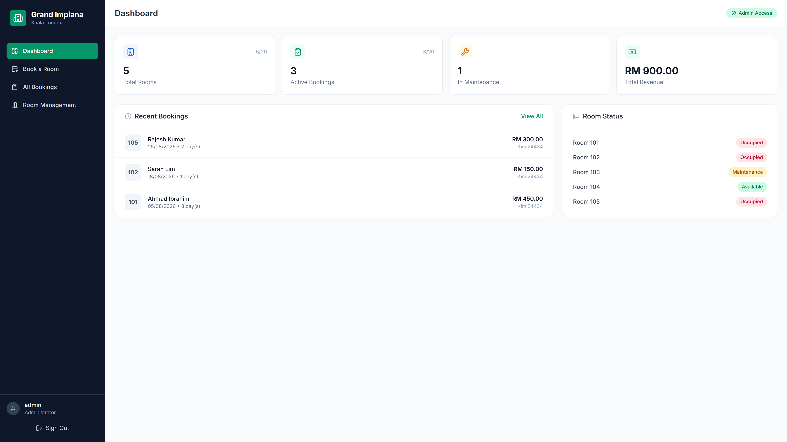
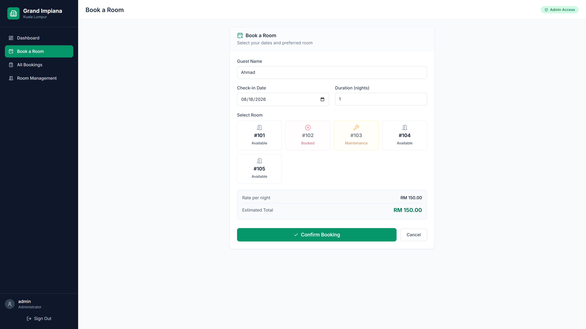
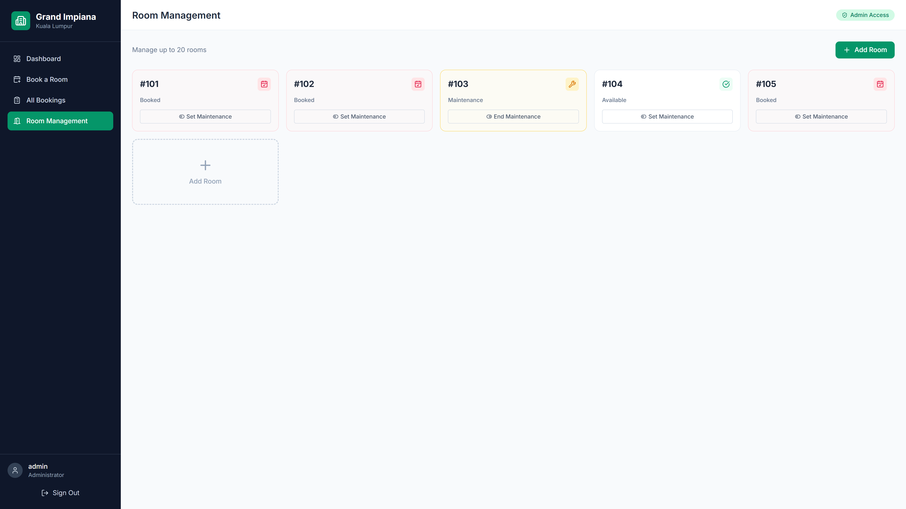
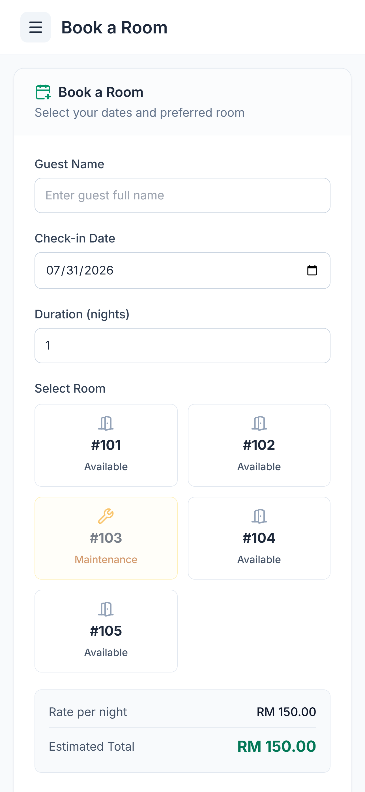
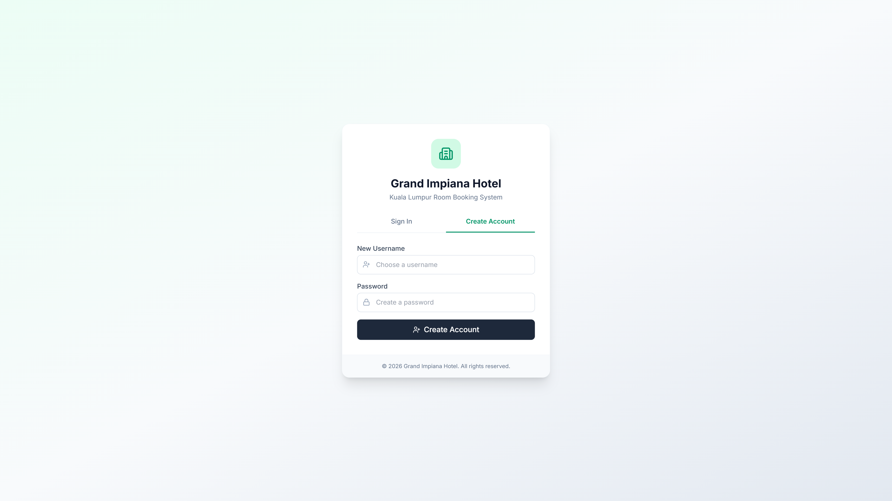
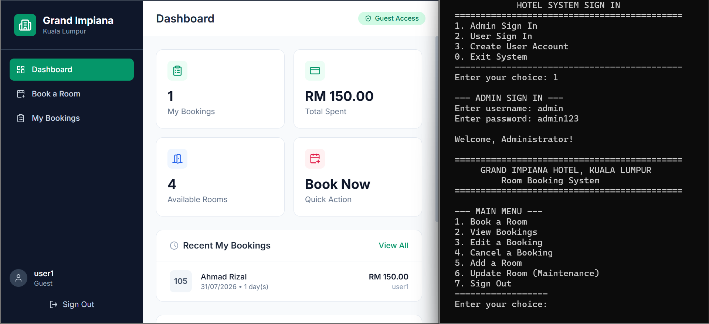

# 🏨 Grand Impiana Hotel Booking System

> **University Project - Full-Stack Web Application**  
> Originally developed as a C++ console application, migrated to a modern responsive web platform.

[](https://developer.mozilla.org/en-US/docs/Web/HTML)
[](https://developer.mozilla.org/en-US/docs/Web/CSS)
[](https://developer.mozilla.org/en-US/docs/Web/JavaScript)
[](https://tailwindcss.com)
[](https://lucide.dev)

---

## 📋 Table of Contents
- [About the Project](#about-the-project)
- [Features](#features)
- [Tech Stack](#tech-stack)
- [Screenshots](#screenshots)
- [Getting Started](#getting-started)
- [Project Evolution](#project-evolution)
- [System Architecture](#system-architecture)
- [Future Improvements](#future-improvements)
- [License](#license)

---

## 🎯 About the Project

This project is a **room booking and management system** for Grand Impiana Hotel, Kuala Lumpur. It was originally built as a terminal-based C++ application for a university programming course and later **completely re-engineered** into a responsive single-page web application to demonstrate full-stack development skills.

The system supports dual-role access (Admin & Guest), real-time room availability with conflict detection, maintenance scheduling, and persistent data storage.

---

## ✨ Features

### 👤 Guest (User) Role
- [x] Create personal account (max 10 users)
- [x] Book available rooms with date selection
- [x] View personal booking history
- [x] Edit own bookings (change room or dates)
- [x] Cancel own bookings with confirmation
- [x] Real-time bill estimation (RM 150/night)

### 🛡️ Admin Role
- [x] Secure admin dashboard (`admin` / `admin123`)
- [x] View **all** system bookings
- [x] Edit **any** booking system-wide
- [x] Cancel **any** booking
- [x] Add new rooms to inventory (max 20 rooms)
- [x] Toggle room maintenance status
- [x] Conflict detection prevents double-booking

### ⚙️ System Features
- [x] **Date Conflict Algorithm** - Prevents overlapping reservations for the same room
- [x] **Maintenance Lock** - Rooms under maintenance are automatically excluded from booking
- [x] **Persistent Storage** - Uses browser `localStorage` as a lightweight database
- [x] **Responsive Design** - Fully functional on mobile, tablet, and desktop
- [x] **Form Validation** - Client-side validation with user-friendly error messages
- [x] **Toast Notifications** - Non-blocking feedback for all user actions

---

## 🛠️ Tech Stack

| Layer | Technology | Purpose |
|-------|-----------|---------|
| **Frontend** | HTML5 | Semantic page structure |
| **Styling** | Tailwind CSS (CDN) | Utility-first responsive design |
| **Icons** | Lucide Icons | Consistent, lightweight iconography |
| **Logic** | Vanilla JavaScript | Zero-dependency application logic |
| **Storage** | localStorage API | Client-side persistent database |
| **Fonts** | Inter (Google Fonts) | Modern, readable typography |

> **Why no frameworks?** This project intentionally uses vanilla JS to demonstrate core programming fundamentals (DOM manipulation, state management, algorithm implementation) without framework abstraction.

---

## 📸 Screenshots

### Admin Dashboard


### Room Booking Form


### Room Management (Admin Only)


### Mobile Responsive View


### Login Screen


### Bonus


### Demo


---

## 🚀 Getting Started

### Prerequisites
- Any modern web browser (Chrome, Firefox, Edge, Safari)
- No server or build tools required!

### Installation
1. Clone the repository
   ```bash
   git clone https://github.com/amzarmukminn/hotel-booking-system.git
   ```
2. Navigate to the project directory
   ```bash
   cd hotel-booking-system
   ```
3. Open `src/web/index.html` in your browser, or use a live server:
   ```bash
   # Option A: Direct open
   open src/web/index.html

   # Option B: VS Code Live Server
   code src/web/index.html
   ```

### Default Credentials
| Role | Username | Password |
|------|----------|----------|
| Admin | `admin` | `admin123` |
| User | Create via "Create Account" | Your choice |

---

## 🔄 Project Evolution

This repository includes the **original C++ source code** (`hotelbook.cpp`) to showcase the development journey:

| Aspect | C++ Version | Web Version |
|--------|-------------|-------------|
| **Interface** | Console I/O (`cin`/`cout`) | Interactive GUI with Tailwind CSS |
| **Data Storage** | Fixed-size arrays in RAM | Dynamic `localStorage` objects |
| **Date Logic** | `dateToDays()` algorithm | Preserved exactly in JavaScript |
| **Conflict Check** | Nested loop array scanning | Optimized array methods |
| **User Roles** | Enum-based switch statements | Conditional DOM rendering |
| **Persistence** | Lost on program exit | Survives browser sessions |

> The core booking algorithm (`dateToDays`, `checkDateOverlap`, `hasBookingConflict`) was **directly translated** from C++ to JavaScript to maintain algorithmic integrity while modernizing the user experience.

---

## 🏗️ System Architecture

```
┌─────────────────────────────────────┐
│           Presentation Layer          │
│  (HTML + Tailwind CSS + Lucide Icons) │
└──────────────────┬──────────────────┘
                   │
┌──────────────────▼──────────────────┐
│          Application Layer          │
│     (Vanilla JavaScript Modules)    │
│  • Auth Controller                  │
│  • Booking Controller               │
│  • Room Controller                  │
│  • Date/Conflict Engine             │
└──────────────────┬──────────────────┘
                   │
┌──────────────────▼──────────────────┐
│            Data Layer               │
│      (Browser localStorage)         │
│  • users[]  • rooms[]  • bookings[] │
└─────────────────────────────────────┘
```

### Key Algorithms Preserved from C++
- **`dateToDays(dd/mm/yyyy)`**: Converts calendar dates to linear day counts for arithmetic comparison
- **`checkDateOverlap()`**: Interval intersection logic - `(start1 < end2) && (start2 < end1)`
- **`hasBookingConflict()`**: Scans active bookings to enforce room-date uniqueness

---

## 🔮 Future Improvements

While this version satisfies university requirements, potential enhancements include:

- [ ] **Backend Migration**: Replace `localStorage` with Node.js + MongoDB/PostgreSQL
- [ ] **Authentication**: Implement JWT tokens and password hashing (bcrypt)
- [ ] **Real Dates**: Integrate a proper date library (date-fns) for leap year accuracy
- [ ] **Email Notifications**: Booking confirmations via Nodemailer
- [ ] **Payment Gateway**: Integrate Stripe or PayPal for real transactions
- [ ] **PWA Support**: Service workers for offline capability
- [ ] **Unit Testing**: Jest tests for conflict detection algorithms
- [ ] **CI/CD**: GitHub Actions for automated deployment

---

## 🎓 University Context

- **Course**: IMS450 - PROBLEM SOLVING AND PROGRAM DESIGN 1
- **Institution**: Universiti Teknologi MARA
- **Semester**: Semester 2
- **Key Learning Outcomes**:
  - Algorithm translation across programming paradigms
  - Client-side state management without frameworks
  - Data persistence strategies

---

## 📄 License

This project is licensed under the MIT License - see the [LICENSE](LICENSE) file for details.

---

## 🙋‍♂️ Contact

- **GitHub**: [amzarmukminn](https://github.com/amzarmukminn)
- **LinkedIn**: [nil](https://linkedin.com/in/nil)
- **Email**: amzarmukmin10@gmail.com

> **Note**: This is a demonstration project. Do not use default credentials (`admin/admin123`) in production environments.

---

<p align="center">
  <i>Built with patience, caffeine, and a lot of console.log() debugging.</i> ☕
</p>
